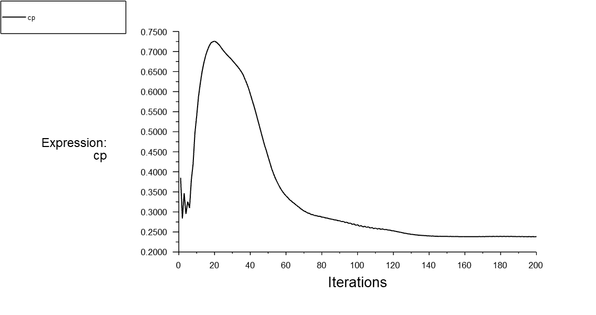
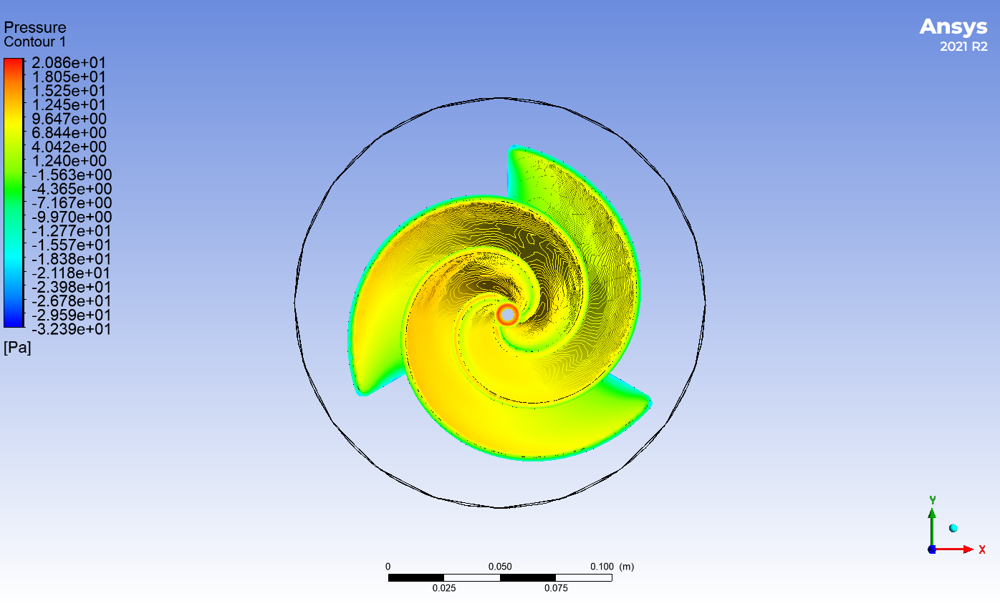
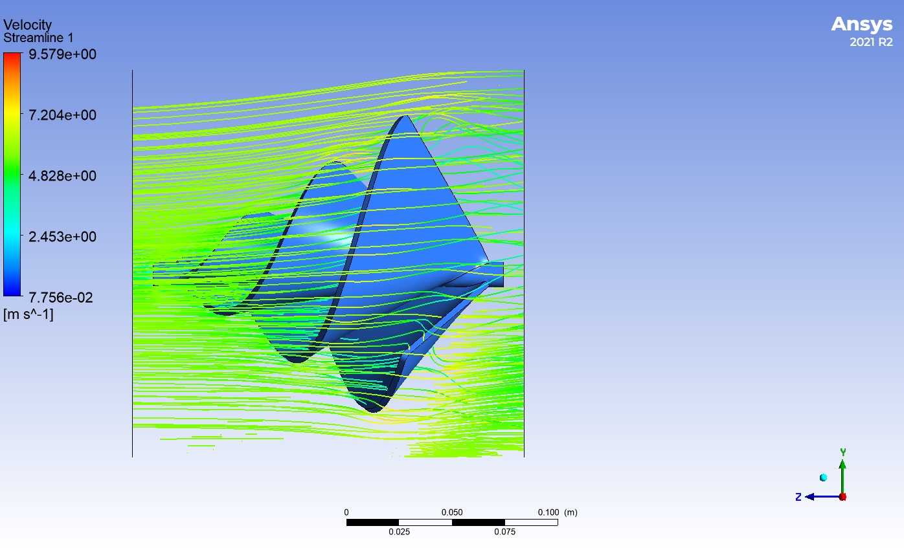
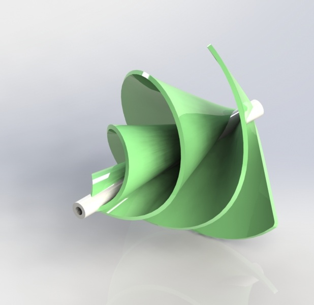

# Archimedes Wind Turbine - CFD Analysis

## 📌 Project Overview
This project involves the CFD simulation of an Archimedes Spiral Wind Turbine using **ANSYS Fluent**. The study focuses on aerodynamic performance, pressure distribution, and flow behavior around the spiral blades, which are designed for low-speed urban wind environments.

---

## 📸 Visualization & Results

### 1. Aerodynamic Performance (Cp Graph)
The Power Coefficient (Cp) was monitored over 200 iterations to ensure convergence and evaluate the turbine's efficiency.

### 2. Pressure & Velocity Analysis
- **Pressure Contours:** Show the pressure differential across the spiral blades, which generates the required torque.
- **Velocity Streamlines:** Visualize the spiral flow interaction and wake regions.

| Pressure Contour | Velocity Streamlines |
| :---: | :---: |
|  |  |

---

## 🛠 Project Workflow
- **CAD Modeling:** Designed the spiral blade geometry in SolidWorks.
- **Meshing:** Generated a computational mesh optimized for rotating fluid domains.
- **CFD Simulation:** Performed steady-state analysis in ANSYS Fluent to extract aerodynamic coefficients.

## 📂 Folder Structure
- `CAD/`: SolidWorks part files.
- `Mesh/`: Mesh screenshots and quality details.
- `Post_Processing/`: Pressure/Velocity contours and convergence plots.
- `Render/`: Photorealistic design visualizations.

